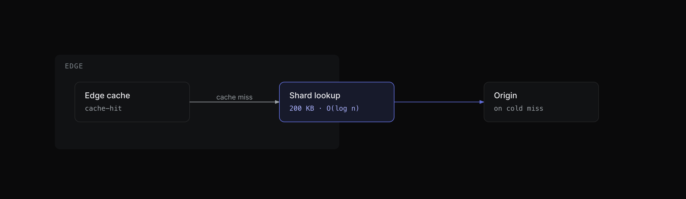
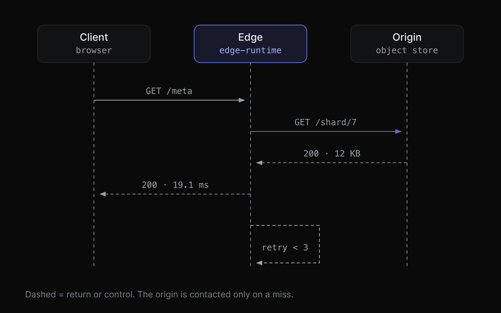

# skills

[English](README.md) · [简体中文](README.zh-CN.md)

Agent skills by [@Loner1024](https://github.com/Loner1024). Each skill is a self-contained folder
following the [Agent Skills specification](https://agentskills.io): a `SKILL.md` with YAML
frontmatter plus the references, assets, and scripts it needs.

Install any of them into Claude Code, Codex, Cursor, Droid, OpenCode, Zed, or one of the
[other supported agents](https://github.com/vercel-labs/skills#supported-agents) with one command.

[](https://skills.sh/Loner1024/skills)

## Install

```bash
# see what is in here
npx skills add Loner1024/skills --list

# interactive picker: choose skills, agents, and scope
npx skills add Loner1024/skills

# non-interactive: one skill, global scope, to specific agents
npx skills add Loner1024/skills --skill tech-diagrams -g -a claude-code -a codex -a droid -y

# everything, to every agent you have installed
npx skills add Loner1024/skills --all
```

Without installing, you can load a single skill into an agent for one session:

```bash
npx skills use Loner1024/skills@tech-diagrams | claude
```

Update later with `npx skills update -g`, and remove with `npx skills remove <skill>`.

## Skills

| Skill | What it does | Requirements |
| --- | --- | --- |
| [`tech-diagrams`](skills/tech-diagrams) | Draws publication-quality technical figures as hand-authored SVG plus a self-contained HTML preview, and lints them before delivering. 14 figure types, from architecture topology to sequence, state machine, benchmark bars, and terminal window frames. Also decides **when not to draw**. | `python3`, `rsvg-convert`, Chrome/Chromium (for HTML previews) |

## tech-diagrams

Most agent-made diagrams are Mermaid block layouts: every box the same size, arrows that start in
empty space, labels the boxes paint over. This skill encodes the opposite approach, derived from a
close reading of how Linear, Cursor, Vercel, Anthropic, and OpenAI actually present figures in
their technical writing. The per-company evidence lives in [`research/`](research); the skill does
not read it.

It delivers two artifacts per figure:

| Artifact | Purpose |
| --- | --- |
| `<slug>.html` | Self-contained preview: inline SVG plus inlined design tokens, no external requests, opens offline |
| `<slug>.svg` | Single-file deliverable for a README, a doc, a blog post, or a slide |

Plus a caption line that doubles as the image `alt`, and one sentence on what the figure
deliberately leaves out.





### What it enforces

- **One claim per figure**, stated in the caption, which is also the `alt` text.
- **A figure only when prose cannot carry the structure**: comparisons of more than three things,
  multi-step causality, state that changes over time, or measurements where rank matters.
  Otherwise it says "use a table" and stops.
- **A geometry budget**: at most 9 nodes, one focal element, a 4px grid, radii ≤ 8px, 1px strokes,
  orthogonal connectors only, 11px minimum type.
- **Connector hygiene**: both ends of every arrow land on something visible (a box border, a
  lifeline, a start dot), arrowheads never aim at a corner, no line crosses a box that is not its
  endpoint, and short arrows carry a label.
- **One accent colour per figure.** No gradients, glows, drop shadows, or decorative chrome.
- **Contrast and CJK font stacks checked mechanically**, so the rasteriser cannot silently tofu.

### Workflow

```bash
cd skills/tech-diagrams

# 1. start from a template (dark is the default register)
mkdir -p figures && cp assets/template-dark.html figures/my-figure.html

# 2. check the source, then look at the raster
python3 scripts/self_check.py figures/my-figure.html --strict
./scripts/render.sh figures/my-figure.html --scale 2

# 3. lint the source against its own render (catches blank and over-sparse output)
./scripts/render.sh figures/my-figure.svg --scale 2
python3 scripts/self_check.py figures/my-figure.svg --png figures/my-figure.png

# after editing the reference docs, prove the snippets inside them still pass
python3 scripts/lint_docs.py
```

The renderer needs `rsvg-convert` (`brew install librsvg` on macOS) for SVG and a headless
Chrome/Chromium for HTML previews. The linter is stdlib-only Python. Figures were authored and
rendered on macOS; `rsvg-convert` and Chrome resolve fonts differently elsewhere, which is why the
CJK stack is listed explicitly.

### Honest limits

The linter checks what can be checked. Visual taste, line weight, and whether the figure actually
persuades still need a human eye on the PNG. If the agent cannot view images in a session, it says
so and hands you the render for the final look.

## Repository layout

```
research/                        provenance, not part of any skill
  FINDINGS.md                    how the five companies present figures, per company, with links
  TAXONOMY.md                    the decision taxonomy and tooling survey behind the rules
skills/
  tech-diagrams/
    SKILL.md                     entry point: workflow, routing table, hard rules
    references/                  when-to-draw · registers · primitives · type-* · verification · export
    assets/                      tokens.css + dark and light starting templates
    scripts/                     render.sh · self_check.py · lint_docs.py
    examples/                    seven finished figures across the four type families
```

`skills/<name>/` is the install unit: that is the whole directory `npx skills` copies. Every skill
here is self-contained and reads nothing outside its own folder, so a skill behaves identically
from a clone of this repo and from an installed copy.

`research/` is the exception by design: it is in the repo for a human deciding whether to trust a
rule, and nothing under `skills/` reads it. Delete the folder and every skill still works. It is
written in Chinese; the operational rules are the English files under
`skills/tech-diagrams/references/`.

## Adding a skill

```
skills/<skill-name>/SKILL.md     # frontmatter needs name and description; lowercase-hyphenated name
```

Commit, push, and it becomes installable immediately: `npx skills add Loner1024/skills --list`
picks up anything under `skills/`. Keep each skill self-contained, put anything it only needs at
runtime inside its own folder, and prefer scripts over prose when a rule can be verified
mechanically.

## License

[MIT](LICENSE). Third-party material is attributed where it appears.
